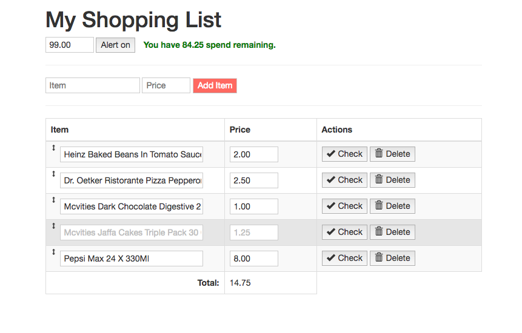

# shopping_list_app
Shopping list application



## Setting up

To run the app, you need to deploy it to a web server running PHP and MySQL.\
The version of PHP developed on was version 7.1.14 but it does not reply on any PHP7 features so in theory it should still run on older versions such ad PHP 5.6 just fine.

The app also requires internet access as it uses CDN's to fetch JQuery, JQuery-UI and Twitter Bootstrap libraries.

1. clone the GIT repo
2. create the database and populate with some test data via executing the SQL below.

## Test database

```CREATE DATABASE shopping_list;

CREATE TABLE IF NOT EXISTS list (
    id INT UNSIGNED NOT NULL AUTO_INCREMENT PRIMARY KEY,
    title VARCHAR(255) NOT NULL,
    max_spend DECIMAL(6,2) NOT NULL,
    is_alert TINYINT(1) NOT NULL DEFAULT 0
) ENGINE=InnoDB;

CREATE TABLE IF NOT EXISTS items (
    id INT UNSIGNED NOT NULL AUTO_INCREMENT PRIMARY KEY,
    list_id INT UNSIGNED NOT NULL,
    name VARCHAR(255) NOT NULL,
    price DECIMAL(6,2) NOT NULL,
    is_checked TINYINT(1) NOT NULL DEFAULT 0,
    position INT UNSIGNED NOT NULL,
    FOREIGN KEY (list_id) REFERENCES list(id)
) ENGINE=InnoDB;

INSERT INTO list (title)
    VALUES ("My Shopping List");

INSERT INTO items (list_id, name, price, is_checked, position) VALUES
        (1, 'Heinz Baked Beans In Tomato Sauce 4 X415g', 2.00, 0, 1),
        (1, 'Dr. Oetker Ristorante Pizza Pepperoni Salame 320G', 2.50, 0, 2),
        (1, 'Mcvities Dark Chocolate Digestive 266G', 1.00, 1, 3),
        (1, 'Mcvities Jaffa Cakes Triple Pack 30 Cakes', 1.25, 1, 4),
        (1, 'Pepsi Max 24 X 330Ml', 8.00, 0, 5);
```
